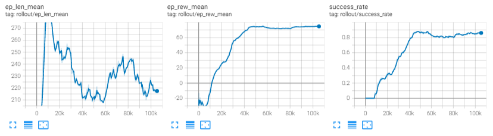
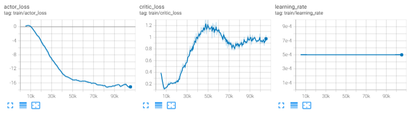

# UAV_Navigation_DRL_AirSim

This is a new repo used for training UAV navigation (local path planning) policy using DRL methods.

## Requirements

- [AirSim](https://microsoft.github.io/AirSim/) v1.6.0
- pytorch 1.10.1
- gym-0.21.0

## Submodules

- [Stable-baselines3](https://github.com/heleidsn/stable-baselines3) v1.4.0
  - `cd stable-baselines3`
  - `pip install -e .`
- [gym_airsim_multirotor](https://github.com/heleidsn/gym_airsim_multirotor)
  - `cd gym_airsim_multirotor`
  - `pip install -e .`

## windows install CUDA and PyTorch

- Download [CUDA11.6](https://developer.nvidia.com/cuda-downloads?target_os=Windows&target_arch=x86_64&target_version=10&target_type=exe_local)
- `pip3 install torch==1.10.1+cu113 torchvision==0.11.2+cu113 torchaudio===0.10.1+cu113 -f https://download.pytorch.org/whl/cu113/torch_stable.html`

## Usage

1. Clone this repo and the submodules
   1. `git clone https://github.com/heleidsn/UAV_Navigation_DRL_AirSim.git --recursive`
2. Install gym_airsim_multirotor
   1. `cd gym_airsim_multirotor`
   2. `pip install -e`
3. Download a AirSim environment, such as Blocks from [Here](https://github.com/microsoft/AirSim/releases/tag/v1.6.0-windows) and run it
4. Start training
   1. `cd scripts`
   2. `python train.py`

## Results

Training result using TD3 with no_cnn policy





### Train

### Evaluate

## Settings

```json
{
  "SeeDocsAt": "https://github.com/Microsoft/AirSim/blob/master/docs/settings.md",
  "SettingsVersion": 1.2,
  "SimMode": "ComputerVision",
  "SubWindows": [
    {"WindowID": 0, "CameraID": 0, "ImageType": 0, "Visible": true},
    {"WindowID": 1, "CameraID": 0, "ImageType": 3, "Visible": false},
    {"WindowID": 2, "CameraID": 0, "ImageType": 3, "Visible": true}
    ],
  "CameraDefaults": {
    "CaptureSettings": [
      {
        "ImageType": 3,
        "Width": 100,
        "Height": 80,
        "FOV_Degrees": 90,
        "AutoExposureSpeed": 100,
        "AutoExposureBias": 0,
        "AutoExposureMaxBrightness": 0.64,
        "AutoExposureMinBrightness": 0.03,
        "MotionBlurAmount": 0,
        "TargetGamma": 1.0,
        "ProjectionMode": "",
        "OrthoWidth": 5.12
      },
      {
        "ImageType": 0,
        "Width": 256,
        "Height": 144,
        "FOV_Degrees": 90,
        "AutoExposureSpeed": 100,
        "AutoExposureBias": 0,
        "AutoExposureMaxBrightness": 0.64,
        "AutoExposureMinBrightness": 0.03,
        "MotionBlurAmount": 0,
        "TargetGamma": 1.0,
        "ProjectionMode": "",
        "OrthoWidth": 5.12
      }
    ]
  }
}
```
