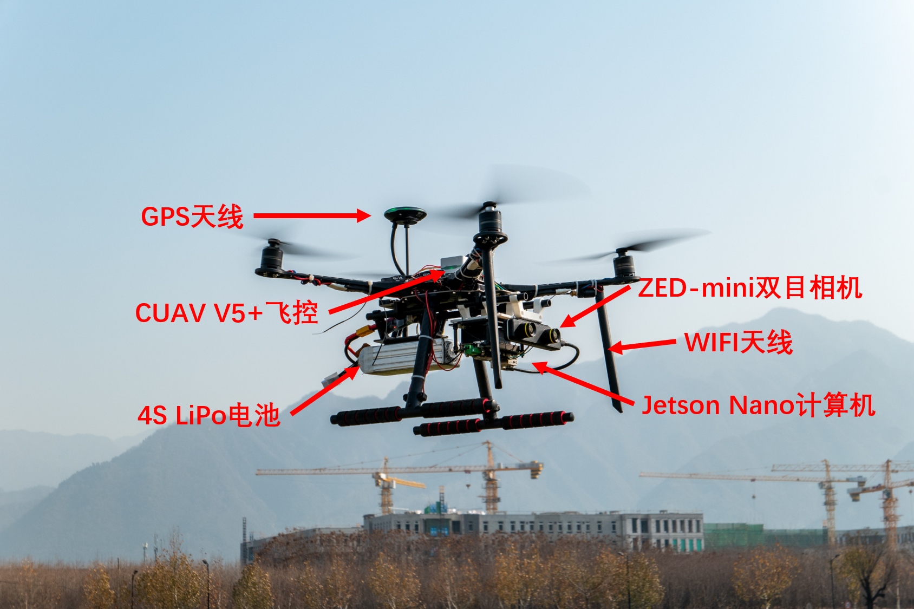
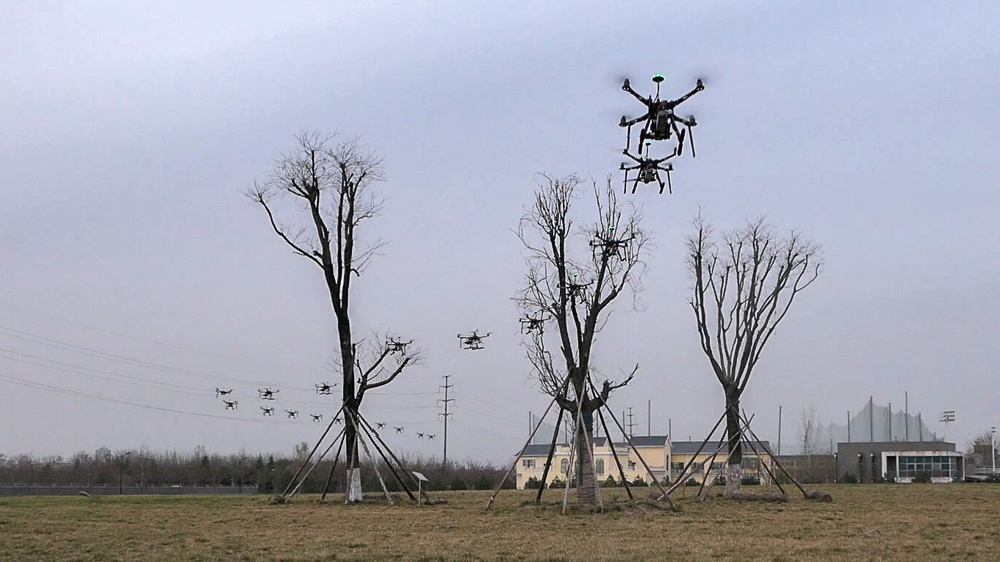
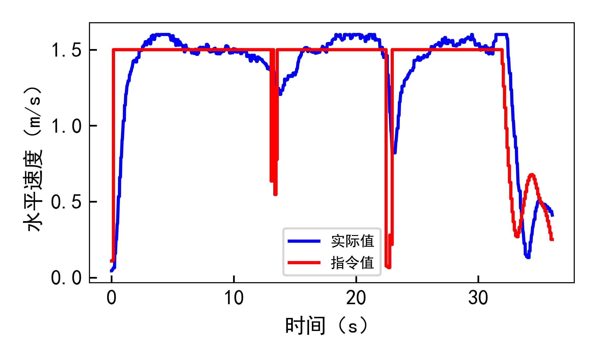
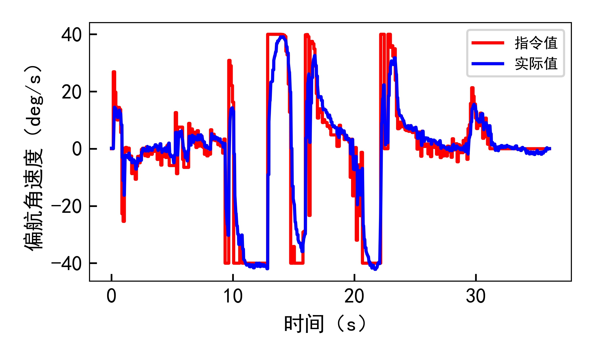
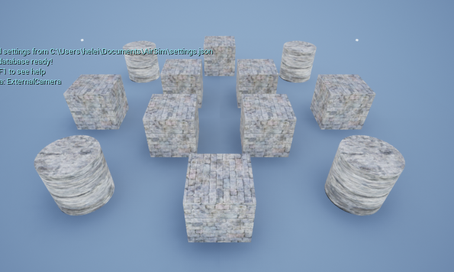
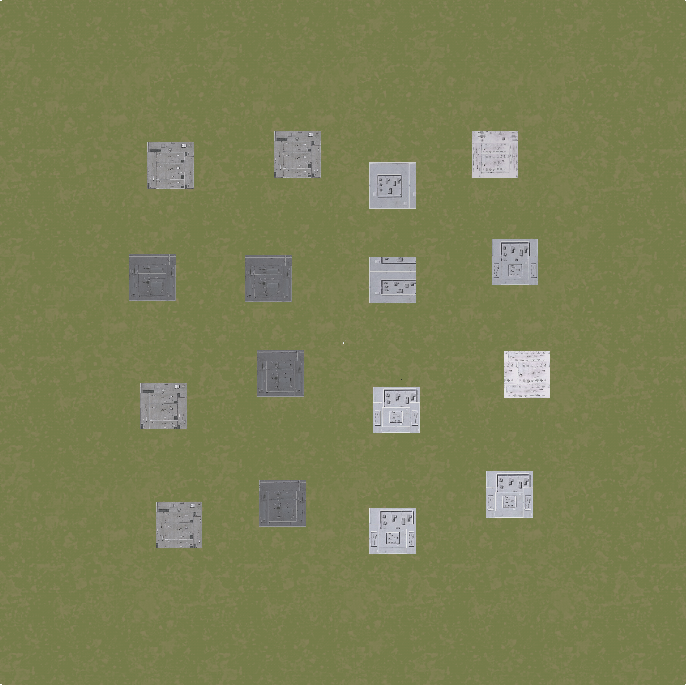
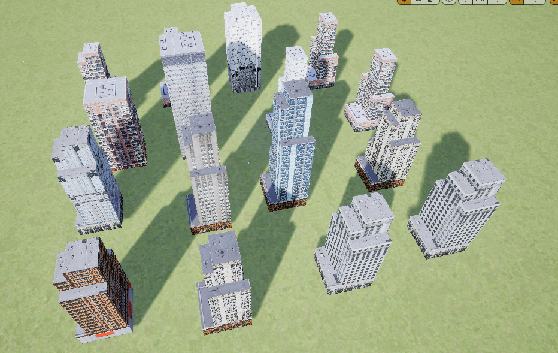
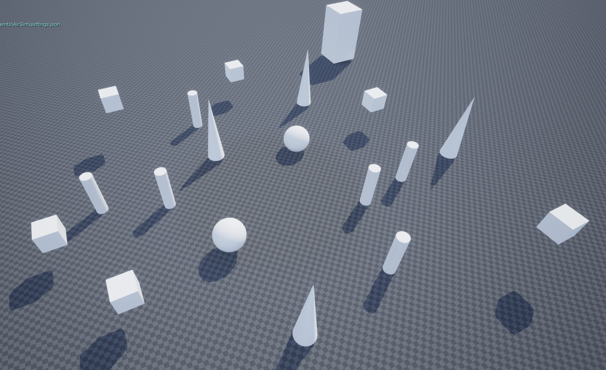
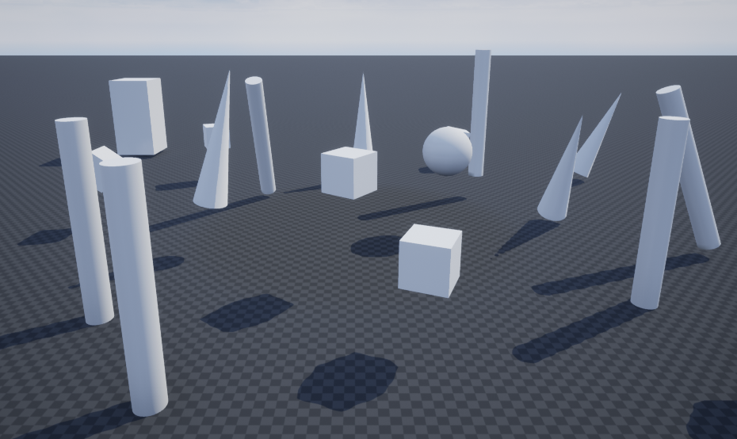
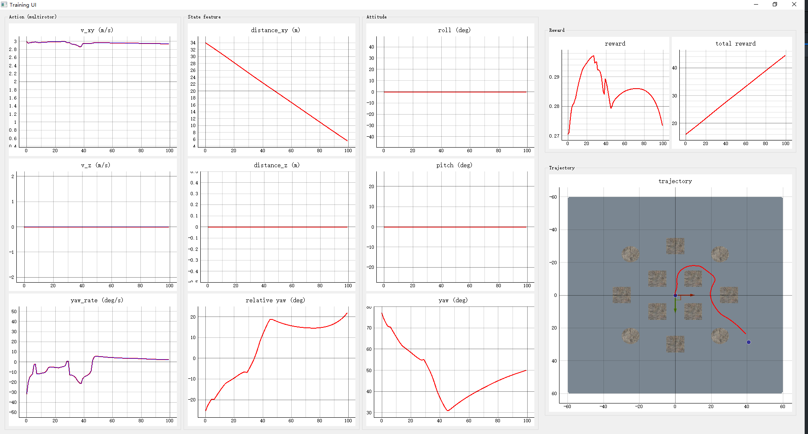

# UAV_Navigation_DRL_AirSim

A platform for training UAV navigation policies in complex unknown environment.

- An Open AI Gym env is created include kinematic models for both multirotor and fixed-wing UAVs.
- Some UE4 environments are provided to train and test the navigation policy.
- based on AirSim and SB3.

Try to train your own autonomous flight policy and even transfer it into real UAVs! Have fun ^_^!

<p align="center">
  
  
  <!-- 
   -->
</p>

## Real world transfer

Trained policy can be deployed in the real world directly!!!

<p align="center">
  
  
   
  
</p>

## ChangeLog

- 2024-03-28
  - Deleted the LGMD part
  - Updated README file
- 2022-03-11
  - Add W&B support
- 2022-03-10
  - Remove [gym_airsim_multirotor](https://github.com/heleidsn/gym_airsim_multirotor) submodule
  - Add gym_env as envrionment, include MultirotorSimple, Multirotor and FixedwingSimple dynamics
  - Add train with plot
  - Add SimpleAvoid UE4 environment

## Requirements

- Python 3.8
- [AirSim](https://microsoft.github.io/AirSim/) v1.6.0
- pytorch 1.10.1 with gpu
- gym-0.21.0
- Pyqt5 5.15.6
- keyboard 0.13.5

## Submodules

- [Stable-baselines3](https://github.com/heleidsn/stable-baselines3) v1.4.0

## Install CUDA and PyTorch (Win10)

- Download [CUDA11.6](https://developer.nvidia.com/cuda-downloads?target_os=Windows&target_arch=x86_64&target_version=10&target_type=exe_local)
- `pip3 install torch==1.10.1+cu113 torchvision==0.11.2+cu113 torchaudio===0.10.1+cu113 -f https://download.pytorch.org/whl/cu113/torch_stable.html`
- You can use `tools/test/torch_gpu_cpu_test.py` to test your PyTorch and CUDA.

## Usage

1. Clone this repo and the submodules

   1. `git clone https://github.com/heleidsn/UAV_Navigation_DRL_AirSim.git --recursive`
2. Install gym_env

   1. `cd gym_env`
   2. `pip install msgpack msgpack-rpc-python`
   3. `pip install -e .`

3. Install customized stable-baselines3

   1. `cd stable-baselines3`
   2. `pip install -e .`
   3. If you find the following error, please find the solution [here](https://stackoverflow.com/questions/77124879/pip-extras-require-must-be-a-dictionary-whose-values-are-strings-or-lists-of)

4. Download a AirSim environment, such as [SimpleAvoid](https://drive.google.com/file/d/1QgkZY5-GXRr93QTV-s2d2OCoVSndADAM/view?usp=sharing).

5. If you want to train in other environments please download AirSim released environments from [here](https://github.com/microsoft/AirSim/releases/tag/v1.6.0-windows) and run it.
   - Note the current version is v1.6.0 for Windows, maybe it will be updated to higher version someday.
   - If you get a directX runtime problem, please download and install it [here](https://www.microsoft.com/en-us/download/details.aspx?id=35).
   - You can use `Alt+Enter` to exit the full-screen mode for the first time.
   - You should copy the `settings.json` at the bottom of README to your `/Document/AirSim/settings.json`.

6. Install other python packages

   ```bash
   pip install wandb pyqtgraph seaborn keyboard tensorboard tqdm
   ```

7. Start training

   1. `cd UAV_Navigation_DRL_AirSim`
   2. `python scripts/start_train_with_plot.py`
   3. If you find it's quite slow to get data, please set `ClockSpeed` in `your path to Documents\Airsim\settings.json` over than 1 (such as 10) to speed up the training process.
   4. You log and trained model will be saved to the `log` folder.

8. Evaluation

   1. `cd UAV_Navigation_DRL_AirSim`
   2. `python scripts/start_evaluate_with_plot.py`

## Configs

This repo using config file to control training conditions.

Now we provide 3 training envrionment and 3 dynamics.

**env_name**

* SimpleAvoid

  * This is a custom UE4 environment used for simple obstacle avoidance test. You can download it from [google drive](https://drive.google.com/file/d/1QgkZY5-GXRr93QTV-s2d2OCoVSndADAM/view?usp=sharing).

  <p align="center">
    
    
  </p>
* City_400_400

  * A custom UE4 environment used for fixedwing obstacle avoidance test. You can also get it from [google drive](https://drive.google.com/file/d/1vdT8cP2n_jTk1MdShGwdf1OFPC_YOmTr/view?usp=sharing)

  <p align="center">
    
    
  </p>
* Random obstacles

  * Some envs with random obstacles. Contributed by [Chris-cch](https://github.com/Chris-cch). You can download [here](https://mailnwpueducn-my.sharepoint.com/personal/chenchanghao_mail_nwpu_edu_cn/_layouts/15/onedrive.aspx?id=%2Fpersonal%2Fchenchanghao%5Fmail%5Fnwpu%5Fedu%5Fcn%2FDocuments%2Fnew%5Fenv&ga=1).

  <p align="center">
    
    
  </p>
* Other Airsim build in envrionment (AirSimNH and CityEnviron):

  <p align="center">
    
    
  </p>

**dynamic_name**

* SimpleMultirotor
* Multirotor
* SimpleFixedwing

## GUI for training and evaluation



## Wandb support

[Wandb](https://wandb.ai/site) is a central dashboard to keep track of your hyperparameters, system metrics. You can find examples [here](https://docs.wandb.ai/guides/integrations/other/stable-baselines-3).

> Note: If you use wandb, please run python as **administators**.

## Results

Training result using TD3 with no_cnn policy

## Benchmark

2D depth navigation Benchmark for 3 different algorithms and 5 different policies in SimpleAvoid environment:


## Settings

Note:

To speed up image collection, you can set `ViewMode `to `NoDisplay`.

For multirotor with [simple_flight](https://microsoft.github.io/AirSim/simple_flight/) controller, please set `SimMode `to `Multirotor`. Or you can use `ComputerVision` mode to train without dynamics. You can also set `ClockSpeed `over than 1 to speed up simulation (Only useful in `Multirotor `mode).

Also, it's better to put your environment files in your SSD rather than HDD.

```json
{
  "SeeDocsAt": "https://github.com/Microsoft/AirSim/blob/master/docs/settings.md",
  "SettingsVersion": 1.2,
  "SimMode": "Multirotor",
  "ViewMode": "",
  "ClockSpeed": 1,
  "SubWindows": [
    {"WindowID": 0, "CameraID": 0, "ImageType": 0, "Visible": true},
    {"WindowID": 1, "CameraID": 0, "ImageType": 3, "Visible": false},
    {"WindowID": 2, "CameraID": 0, "ImageType": 3, "Visible": true}
    ],
  "CameraDefaults": {
    "CaptureSettings": [
      {
        "ImageType": 3,
        "Width": 100,
        "Height": 80,
        "FOV_Degrees": 90,
        "AutoExposureSpeed": 100,
        "AutoExposureBias": 0,
        "AutoExposureMaxBrightness": 0.64,
        "AutoExposureMinBrightness": 0.03,
        "MotionBlurAmount": 0,
        "TargetGamma": 1.0,
        "ProjectionMode": "",
        "OrthoWidth": 5.12
      },
      {
        "ImageType": 0,
        "Width": 256,
        "Height": 144,
        "FOV_Degrees": 90,
        "AutoExposureSpeed": 100,
        "AutoExposureBias": 0,
        "AutoExposureMaxBrightness": 0.64,
        "AutoExposureMinBrightness": 0.03,
        "MotionBlurAmount": 0,
        "TargetGamma": 1.0,
        "ProjectionMode": "",
        "OrthoWidth": 5.12
      }
    ]
  }
}
```
